# Tooltitude for Go

[Tooltitude for Go](https://www.tooltitude.com) is a productivity extension for the Go programming language. It helps you write better code faster. The extension is being actively developed so stay tuned for new features (Twitter is the best place to do so https://twitter.com/tooltitude). 

## Features

### CodeLens providers
Gain insights into your codebase, and understand usage patterns for functions, methods, fields, and interfaces.
We have CodeLens providers which help you navigate code and see what's going on in the code base

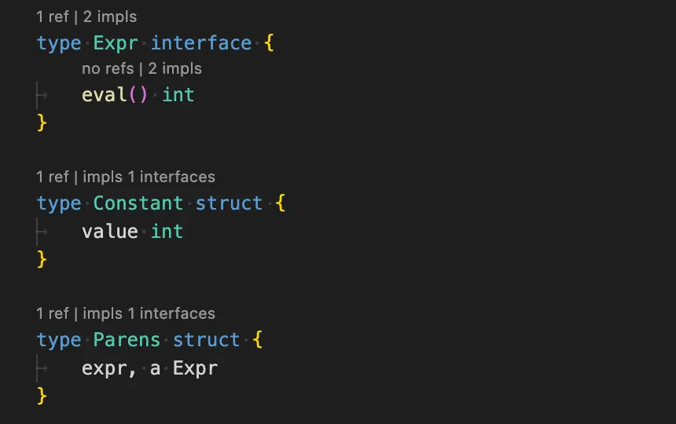

### Code Inspections
From unused initializations and writes to shadowed variables, unhandled errors, and deprecated symbols, our inspections help you enhance your code.

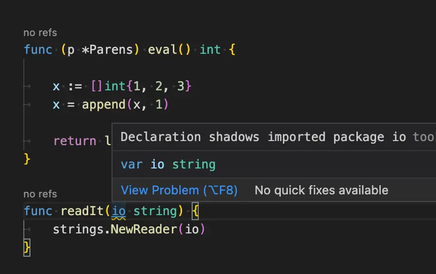

### References View
Get more information than the built-in references popup. References view allows you to see not only the file where the reference is located, but its package, function. Note: it works only with Tooltitude CodeLens providers.

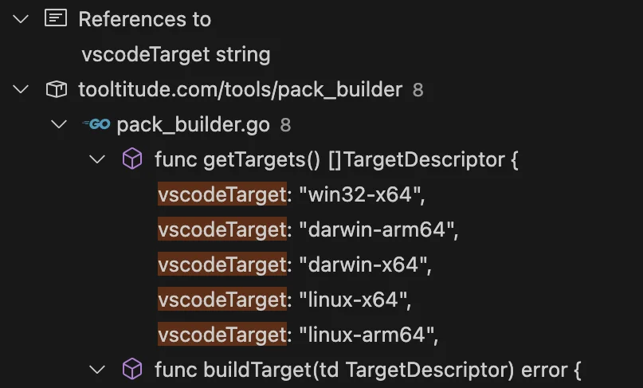

### Debug Individual Table Driven Tests
Debug Individual test driven tests with our debugging code lens.

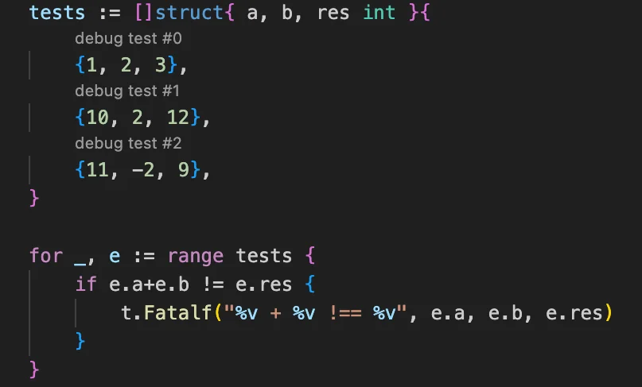

### Postfix Completions
Write code faster by using familiar dot notation to generate boilerplate code: generate statements, call library functions, iterate collections and more.

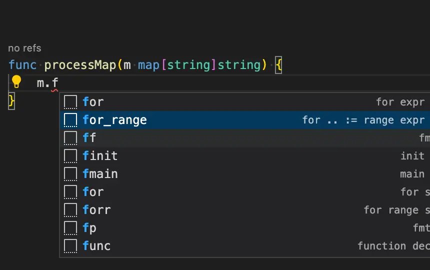

### Code Actions
Make common code changes with confidence: handle errors, manipulate variables, transform expressions and more.

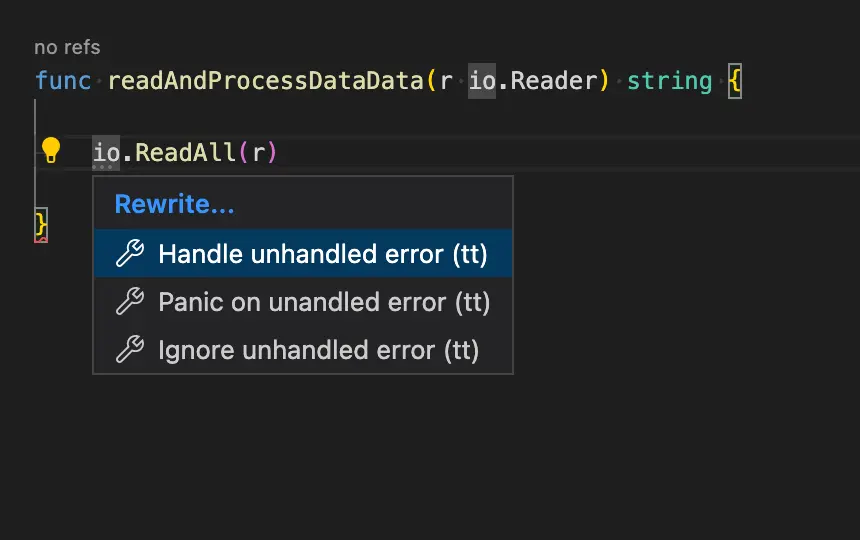

## Premium Features
We have a set of premium features which are available for a license fee:
Learn more about them https://www.tooltitude.com/pricing

### ⭐ Keyboard navigation for Tooltitude CodeLens providers
Use code actions to navigate to methods, implementing interfaces/methods, implemented interfaces/methods. Don't break your flow by using a mouse or touchpad.

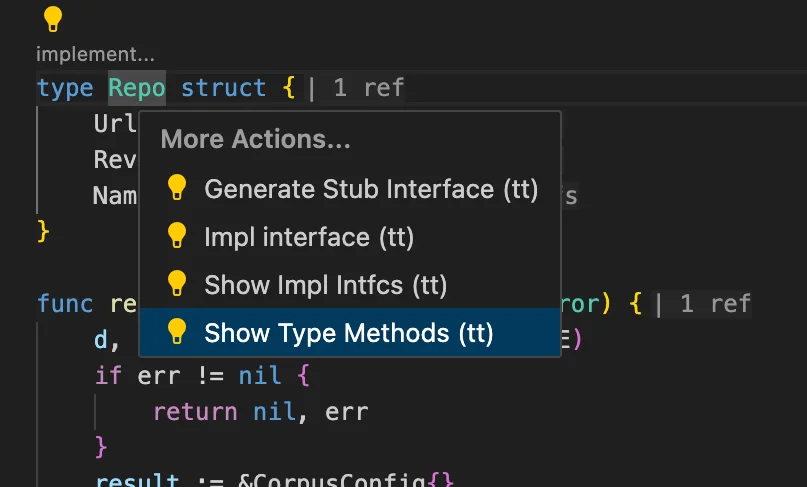

### ⭐ Inline Values In The Debugger
See variable and parameter values right in your editor

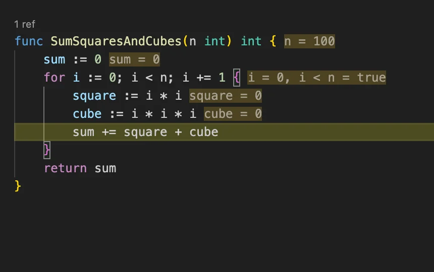

### ⭐ Workspace Wide Unused Symbols Report
Fine entities with no source code reference in the whole workspace

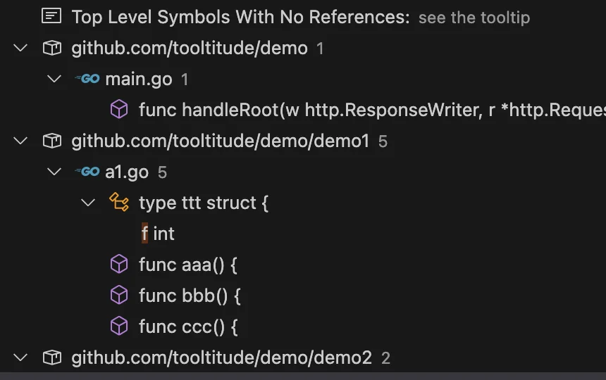

### ⭐ Inlay Reference Counters
Save vertical space with inlay reference counters

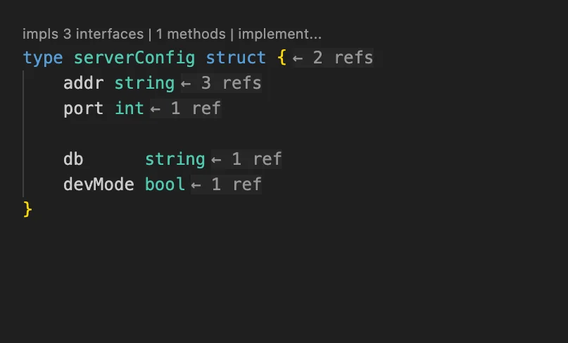

### ⭐ Run/Debug from a Keyboard
Run and Debug tests, and main methods from a keyboard. Don't break your flow by using a mouse or touchpad.

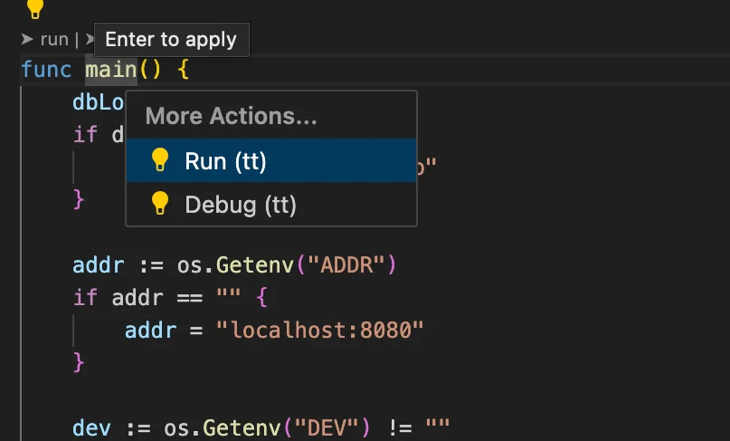

## Feature list
Features with ⭐ require a subscription. Features may have limitations. Software is subject to EULA.

- CodeLens Providers
  - Reference counts for functions, method, interfaces, fields, and interface methods
  - Implementers count for interfaces and interface methods
  - Implemented intefaces for types and methods
  - ⭐ Package imports
  - ⭐ Reference counts for fields (turned off by default, use tooltitude.overlays.refs.fields)
  - ⭐ Option to show reference counts in inlay hints (turned off by default, use tooltitude.inlay.refs)
  - Method counts for non interface types
  - Run or debug main packages
  - Debug table driven tests
  - Implement interface
  - Move declaration (within the same package)
  - ⭐ Move declaration (between packages)
  - Change signature (for private functions, and non interface methods)
  - ⭐ Change signature (for public functions, and non interface methods)
  - Protobuf support
    - Navigation from protobuf files to generated elements for messages, services, and enums
    - ⭐ Go reference counts for messages, enums, and client calls counts for rpc methods in protobuf files
    - ⭐ Go implementation counts for gRPC server implementations of services, and rpc methods
- Helpers
  - ⭐ Automatic update of imports on folder moves and renames
  - ⭐ Automatic update of references on file moves
- Debugging
  - ⭐ Inline values in the debugger
- Inspections
  - Unused assignments/initializations
  - Unused symbols for files and paths
  - ⭐ Unused symbols for the workspace
  - Unreachable code
  - Unhandled errors
  - Variable shadows
  - Deprecated symbols (only if vscode-go isn't installed)
- Postfix Completions
  - Completion for builtin types to invoke standard functions involving these types. As an example, you could write "abc".ToLower and transform it to strings.ToLower("abc)
  - .if for "if expr { }"; .ifn for "if !expr { }" 
  - .ifnil for "if expr == nil { }"; .ifnnil for "if expr != nil { }"
  - .ifempty for "if len(expr) == 0 { }"; .ifnempty for "if len(expr) != 0 { }"
  - .parens for "(expr)"
  - .print, .println, .panic, .len, .cap, .close, .new, .delete, .append or .make to call the corresponding standard library functions
  - .for, .switch, .return, and .defer to complete the corresponding statements
  - .for_range for automatic creation of iteration variables based on expression type
  - .&, .!, .*, .<- for &expr, !expr, *expr, <-expr
  - .var and .const for "var/const id = expr"
  - .=/:= for "id = expr" / "id := expr"
- Code Actions
  - Handle error (with panic, return err, wrapped error)
  - Show references
  - ⭐ Show implementations/implementers for methods/interfaces
  - ⭐ Show implemented interfaces/implementing types
  - ⭐ Show type methods
  - ⭐ Show package imports
  - ⭐ Move declaration
  - ⭐ Change signature (for functions and non interface methods)
  - Rename
  - Extract variable
  - Inline variable
  - ⭐ Extract embedded type
  - ⭐ Inline embedded struct/interface 
  - ⭐ Synchronize receiver names
  - ⭐ Run/debug a main method
  - ⭐ Run/debug a test method
  - Apply De Morgan laws
  - Merge string literals
  - Flip comma
  - Invert if conditions
  - Convert else { if {to else if {
  - Unwrap else code action (return in the if-true block)
  - Iterate over collection
  - Convert raw string <-> string literal
  - Convert separated decimal integer literal <-> non separated integer decimal literal (i.e. 1000000 <-> 1_000_000)
  - Add/remove octal prefix in octal literals (i.e. 0100 <-> 0o100)
  - Convert defer to “multiline” defer (via closure)
  - Add else to if
  - Add channel receive result to assignment
  - Remove redundant parenthesis
  - Convert interface { } to any
  - Convert assignment to unresovled variable to short var decl
  - Flip binary operation, i.e. a + b -> b + a and a > b to b < a
  - Convert x += a to x = x + a and back, as well as with other operations
  - Anonymous func single line to/from multiline func
  - Add var type
  - Rune literal to/from string literal
  - Var to/from short var declaration
  - Split field
  - Rewrite dot import
  - Remove unused import
  - Remove unused imports
  - Sort imports
  - Merge imports
  - Generate getter/setter
  - Generate stub interface for a type
  - Move declaration up/down
  - Remove all tags
  - Add json tag

## Data
We collect anonymous usage data in order to improve our products. To opt-out of data collections, turn off application-wide telemetry setting in Visual Studio Code as directed by the Visual Studio Code documentation before installing the extension, or at any time after the installation: https://code.visualstudio.com/docs/supporting/faq#_how-to-disable-telemetry-reporting Our extension respects this global setting as directed by extension guidelines published by Microsoft. You could read more about our privacy policy here: https://www.tooltitude.com/privacy

## Support Resources
* You could ask for help or suggest a feature by creating an issue in this repository: https://github.com/tooltitude/support/issues/new/choose
* You could join our Discord community: https://discord.gg/f9MHBXsVwr

## Other Links
* Visit our site: https://www.tooltitude.com/
* Follow us on X: https://twitter.com/tooltitude
